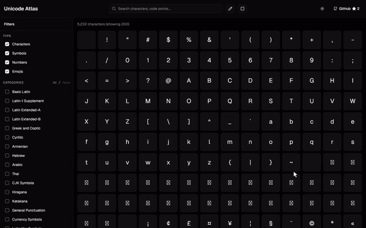
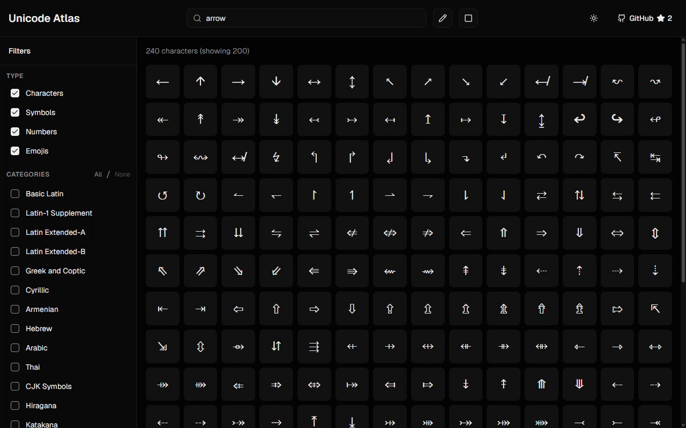

# Unicode Atlas

Search and browse Unicode characters, draw a symbol to find matches, and export characters as images.

## Demo



[Watch the MP4](docs/images/demo.mp4) · [Recording script](docs/demo/README.md)

[Watch the MP4](docs/images/demo.mp4) · [Recording script](docs/demo/README.md)

<details>
<summary>Screenshot</summary>



</details>

[Live demo](https://unicode-atlas.vercel.app)

## Use the app

- Search by character, code point, or name, such as `€`, `U+20AC`, or `euro`.
- Filter by Unicode category and character type.
- Open a character to inspect its code point, category, and visually similar characters.
- Open the drawing tool to sketch a symbol or upload an image for recognition.
- Download individual characters as SVG or PNG, with a solid or transparent background.
- Turn on selection mode to export multiple characters in a ZIP file.

Drawing recognition uses [ShapeCatcher](https://shapecatcher.com) through the app's `/api/recognize` endpoint. Browsing and export run in the browser; recognition requires the external service.

## Run locally

Use Node.js 22 and npm. Bun is also needed for the optional similarity-data generation script.

```bash
git clone https://github.com/SpyC0der77/unicode-atlas.git
cd unicode-atlas
npm ci
npm run dev
```

Open [localhost:3000](http://localhost:3000). No API key or environment file is required.

| Command | Purpose |
| --- | --- |
| `npm run dev` | Start the development server |
| `npm run build` | Build the production app |
| `npm start` | Serve a production build |
| `npm run lint` | Run ESLint |
| `npm run precompute-similar` | Rebuild the precomputed similarity data with Bun |

Run `build` before `start`. Similarity generation uses `@napi-rs/canvas` and can take time; the repo already includes the generated data.

## Source layout

- [`app/page.tsx`](app/page.tsx): search, filters, selection, and keyboard shortcuts.
- [`components/`](components/): character grid, details, drawing modal, and export toolbar.
- [`lib/unicode-data.ts`](lib/unicode-data.ts): Unicode categories and search helpers.
- [`lib/similar-characters.json`](lib/similar-characters.json): precomputed visual matches.
- [`scripts/precompute-similar.ts`](scripts/precompute-similar.ts): similarity-data generator.
- [`app/api/recognize/route.ts`](app/api/recognize/route.ts): ShapeCatcher proxy.

## License

[MIT](LICENSE).
